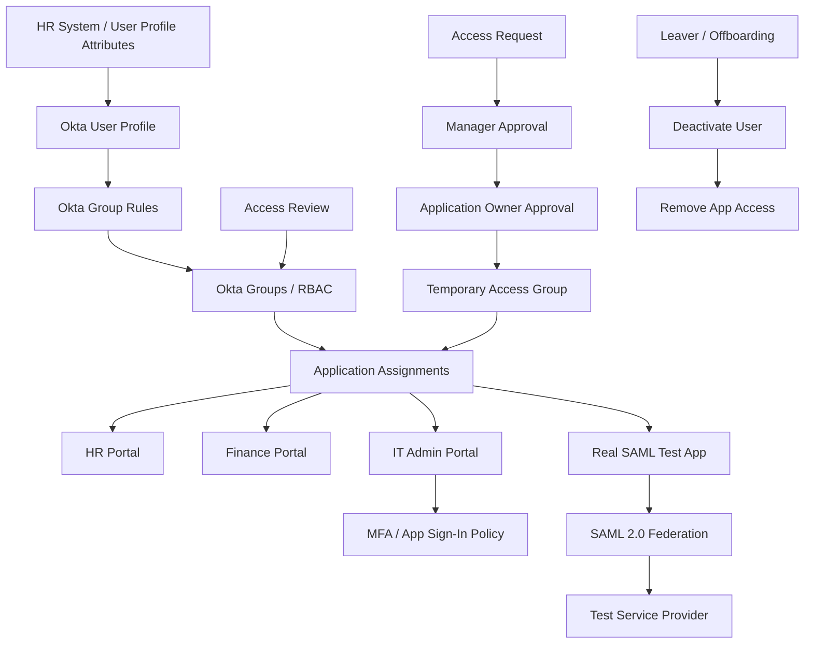

# IAM Architecture Diagram

## Summary

This diagram shows the workforce IAM flow used in the lab:

- User attributes drive group membership
- Groups control application access
- SAML enables federation to external apps
- MFA protects privileged access
- Access requests and reviews support governance
- Offboarding removes access
