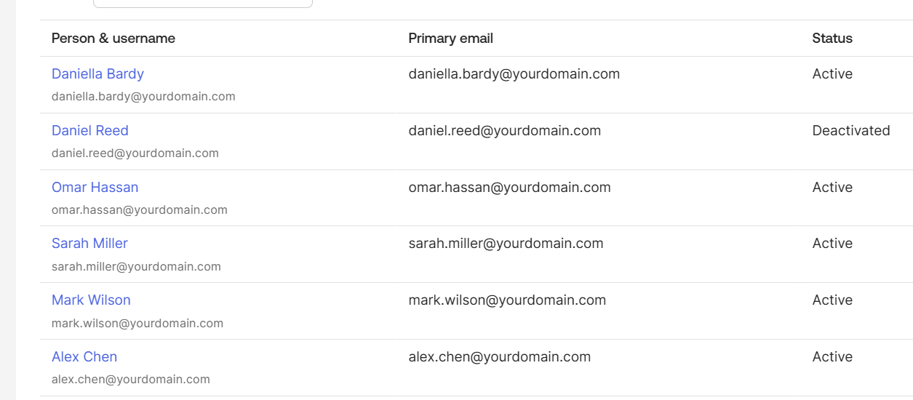
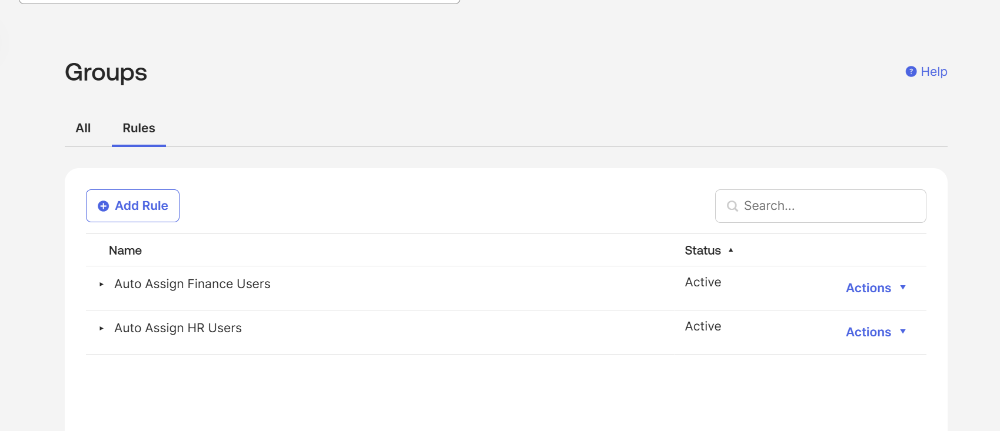

# Joiner, Mover, Leaver Lifecycle

## Objective

The objective of this lab was to simulate the identity lifecycle process for onboarding, department transfer, and offboarding using Okta.

## JML Overview

JML stands for:

- Joiner: a new user joins the organization
- Mover: an existing user changes department or role
- Leaver: a user leaves the organization

## Joiner Scenario

A new user, Daniel Reed, was created as a Finance user.

Access flow:

```text
Daniel Reed → Finance-Team → Finance Portal
```

This simulated onboarding where a new employee receives access based on department, role, or group membership.

## Mover Scenario

Daniel Reed was moved from Finance to HR.

Access changed from:

```text
Daniel Reed → Finance-Team → Finance Portal
```

to:

```text
Daniel Reed → HR-Team → HR Portal
```

This simulated a department transfer where old access is removed and new access is granted based on the updated role or department.

## Leaver Scenario

Daniel Reed was deactivated to simulate offboarding.

Expected result:

```text
Daniel Reed → Deactivated → No application access
```

This simulated the leaver process where a user’s access is removed after leaving the organization.

## Screenshot Evidence



This screenshot validates the leaver scenario by showing Daniel Reed’s account status as Deactivated after offboarding.

## Attribute-Based Group Rule

A group rule was created to automatically assign users to groups based on the department attribute.

Example:

```text
IF department = HR
THEN assign user to HR-Team
```

This simulates HR-driven provisioning where user attributes from a source system such as Workday or SAP SuccessFactors can drive access assignment.

## Group Rule Evidence



This screenshot shows active Okta group rules used to automatically assign users to HR-Team or Finance-Team based on the department attribute.

## Key Concepts Practiced

- Joiner, mover, leaver lifecycle
- Department-based access
- Attribute-based group assignment
- Automated group rules
- RBAC-driven access changes
- Offboarding and account deactivation
- Least privilege access control

## Interview Summary

I simulated JML lifecycle workflows in Okta by creating a new user, assigning access through department-based groups, moving the user between departments, and deactivating the account during offboarding. I also configured group rules to automatically assign users based on department attributes, which mirrors HR-driven provisioning in enterprise IAM environments.
