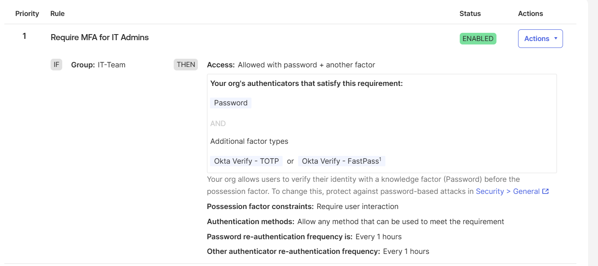

# MFA and App Sign-In Policy

## Objective

The objective of this lab was to configure stronger authentication for privileged application access using Okta Authentication Policies.

## Scenario

The IT Admin Portal represents a high-risk privileged application.

Because admin access has higher security risk, it should require stronger authentication than standard business applications.

## Policy Created

Policy name:

```text
High Risk Admin Access Policy
```

## Screenshot Evidence



This screenshot shows the app sign-in policy requiring password plus another factor for the IT admin group before accessing privileged applications.

## Lab Outcome

Configured an Okta app sign-in policy for a privileged admin application requiring password plus another factor for the IT admin group. This simulated step-up authentication for high-risk access and demonstrated the difference between standard application access and privileged access protection.
