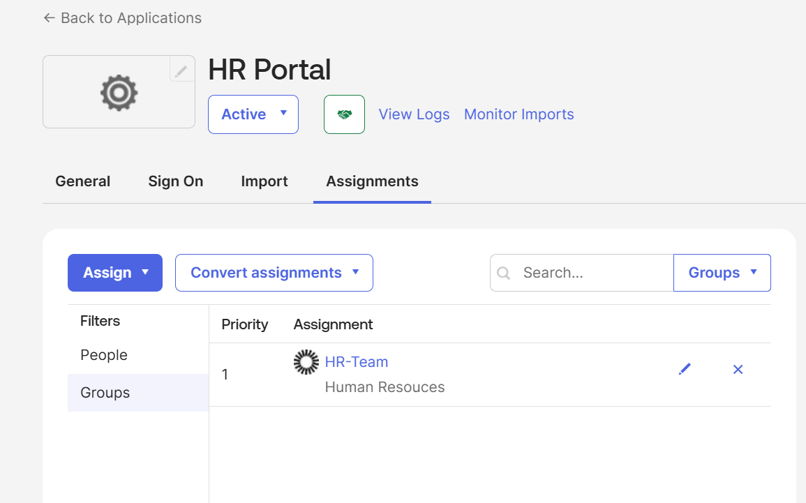

# RBAC Model

## Objective

The objective of this lab was to practice role-based access control using Okta groups and application assignments.

## Design

Instead of assigning applications directly to users, access was assigned through groups.

## Access Mapping

| User | Role / Group | Application |
|---|---|---|
| Omar Hassan | HR-Team | HR Portal |
| Sarah Miller | Finance-Team | Finance Portal |
| Alex Chen | IT-Admins | IT Admin Portal |
| Mark Wilson | Contractors | Contractor Portal |

## Screenshot Evidence

This screenshot shows HR Portal assigned to the HR-Team group, demonstrating group-based RBAC instead of direct user assignment.

## Control Benefit

This model supports:

- Least privilege
- Easier onboarding
- Easier department transfers
- Faster offboarding
- Cleaner access reviews

## Interview Summary

I practiced RBAC in Okta by creating department-based groups and assigning applications to groups instead of individual users. This allowed user access to be managed through role/group membership and supported cleaner joiner, mover, and leaver operations.
