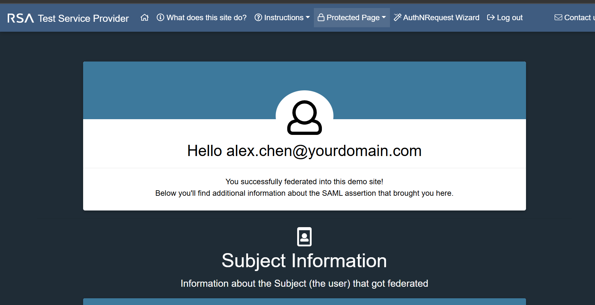

# SAML SSO Integration

## Objective

The objective of this lab was to configure and test a real SAML 2.0 Single Sign-On integration using Okta as the Identity Provider.

## Scenario

Okta was configured as the Identity Provider and a public SAML test Service Provider was used to validate the federation flow.

## SAML Roles

| Component | Role |
|---|---|
| Okta | Identity Provider |
| SAML Test Service Provider | Service Provider |
| Alex Chen | Test user |
| IT-Admins | Assigned access group |

## Configuration Summary

A SAML 2.0 application integration was created in Okta.

The Service Provider values were configured in Okta:

| Okta Field | Purpose |
|---|---|
| Single Sign-On URL | ACS URL where Okta sends the SAML response |
| Audience URI / SP Entity ID | Unique identifier for the Service Provider |
| Name ID Format | EmailAddress |
| Application Username | Email |

## Access Assignment

The SAML test application was assigned to the IT-Admins group.

Access path:

```text
Alex Chen → IT-Admins → Real SAML Test App
```

## Screenshot Evidence



This screenshot validates successful SAML federation from Okta to a real test Service Provider.
